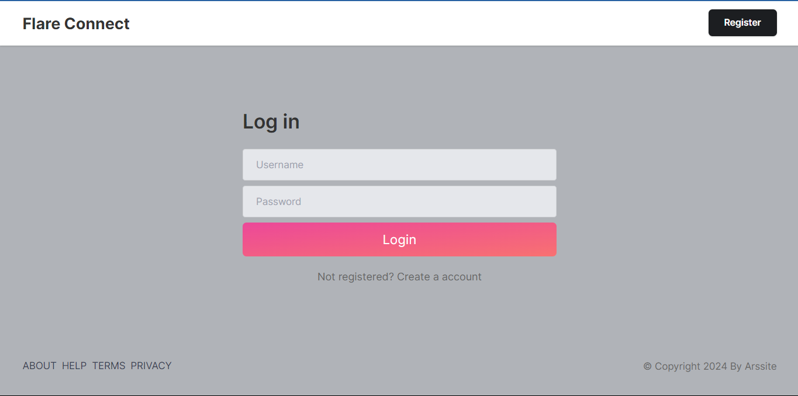
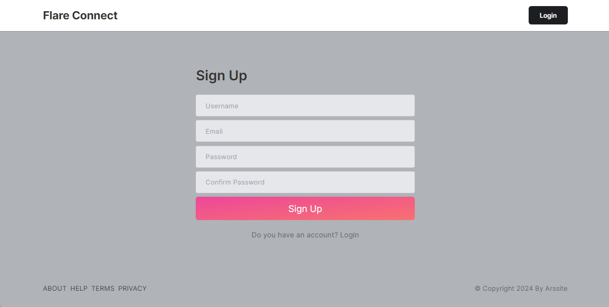
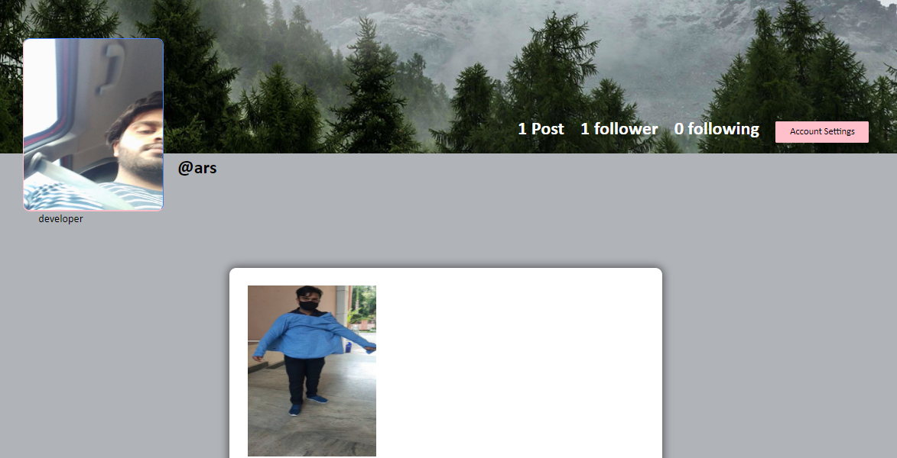
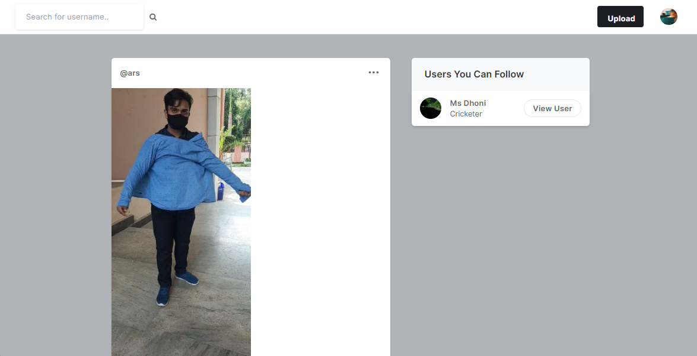

<body>
    <h1>FlareConnect: A Social Media Application</h1>
    
Welcome to FlareConnect, a simple social media application built using the Django framework and SQLite database. This app includes essential features such as user authentication, uploading photos, deleting posts, following/unfollowing users, liking posts, and downloading photos.

 
    <h2>Output</h2>   
    
    
    
    
    <h2>Features</h2>
    <ul>
        <li>User Authentication (Sign Up, Login, Logout)</li>
        <li>Upload Photo</li>
        <li>Delete Post</li>
        <li>Follow/Unfollow Users</li>
        <li>Like Posts</li>
        <li>Download photos</li>
    </ul>
 
    <h2>Requirements</h2>
    <ul>
        <li>Python 3.8+</li>
        <li>Django 3.2+</li>
        <li>SQLite (default with Django)</li>
    </ul>
     
    <h2>Installation</h2>
    <ol>
        <li><b>Clone the repository:</b></li>
        <pre><code>git clone https://github.com/yourusername/flareconnect.git
cd flareconnect</code></pre>
<li><b>Create a virtual environment and activate it:</b></li>
        <pre><code>python3 -m venv env
source env/bin/activate</code></pre>
<li><b>Install the required packages:</b></li>
        <pre><code>pip install -r requirements.txt</code></pre>
      <li><b>Apply migrations:</b></li>
        <pre><code>python manage.py migrate</code></pre>
<li><b>Create a superuser:</b></li>
        <pre><code>python manage.py createsuperuser</code></pre>
<li><b>Run the development server:</b></li>
        <pre><code>python manage.py runserver</code></pre>
<li><b>Open your browser and go to:</b></li>
        
<code>http://127.0.0.1:8000/</code>

    </ol>
 
    <h2>Usage</h2>
    <ul>
        <li><b>Sign Up / Login / Logout:</b> Access authentication pages via the navbar.</li>
        <li><b>Upload Photo:</b> Click on the "Upload" button in the navbar to upload a photo.</li>
        <li><b>Delete Post:</b> Navigate to your post and click the "Delete" button.</li>
        <li><b>Follow/Unfollow Users:</b> Visit a user's profile and click the "Follow" or "Unfollow" button.</li>
        <li><b>Like Posts:</b> Click the "Like" button on a post to like it.</li>
        <li><b>Download Photos:</b> Click the "Download" button on a post to download the photo.</li>
    </ul>
<h2>Project Structure</h2>
    <pre><code>flareconnect/
├── manage.py
├── db.sqlite3
├── README.md
├── requirements.txt
├── flareconnect/
│   ├── __init__.py
│   ├── asgi.py
│   ├── settings.py
│   ├── urls.py
│   ├── wsgi.py
├── app/
│   ├── __init__.py
│   ├── admin.py
│   ├── apps.py
│   ├── forms.py
│   ├── migrations/
│   ├── models.py
│   ├── tests.py
│   ├── views.py
│   ├── templates/
│   │   ├── base.html
│   │   ├── home.html
│   │   ├── upload.html
│   │   ├── profile.html
│   │   ├── post_detail.html
│   ├── static/
│   │   ├── css/
│   │   ├── js/
│   ├── urls.py</code></pre>
<h2>Example Links</h2>
    <ul>
        <li><a href="http://127.0.0.1:8000/">FlareConnect Homepage</a></li>
        <li><a href="http://127.0.0.1:8000/profile/<username>/">User Profile Page</a></li>
        <li><a href="http://127.0.0.1:8000/upload/">Upload Photo Page</a></li>
    </ul>
  <h2>License</h2>
    
This project is licensed under the MIT License.

    <h2>Contributing</h2>
    
Pull requests are welcome. For major changes, please open an issue first to discuss what you would like to change.

    <h2>Contact</h2>
    
For any issues, please contact <a href="https://www.linkedin.com/in/anmol-r-srivastava/">Connect Now</a>.

    <h2>Output Example</h2>
    
</body>
</html>
